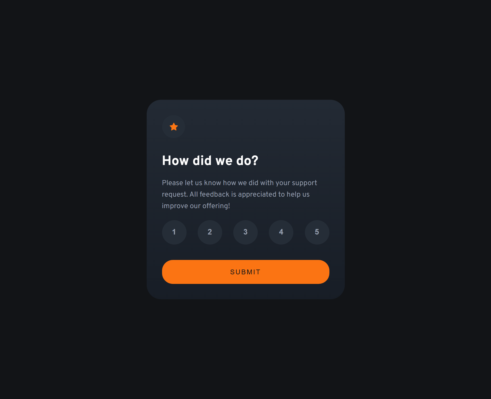

# Frontend Mentor - Interactive rating component


This is a solution to the [Interactive rating component challenge on Frontend Mentor](https://www.frontendmentor.io/challenges/interactive-rating-component-koxpeBUmI). Frontend Mentor challenges help you improve your coding skills by building realistic projects. 

## Table of contents

- [Overview](#overview)
  - [The challenge](#the-challenge)
  - [Screenshot](#screenshot)
  - [Links](#links)
- [My process](#my-process)
  - [Built with](#built-with)
  - [What I learned](#what-i-learned)
  - [Continued development](#continued-development)
- [Author](#author)

## Overview

### The challenge

Users should be able to:

- View the optimal layout for the app depending on their device's screen size
- See hover states for all interactive elements on the page
- Select and submit a number rating
- See the "Thank you" card state after submitting a rating

### Screenshot



### Links

- Solution URL: [interactive-rating-component-main](https://github.com/Emelinur/interactive-rating-component-main)
- Live Site URL: [emelinur.github.io/interactive-rating-component-main/](https://emelinur.github.io/interactive-rating-component-main/)

## My process

### Built with

- **Semantic HTML5 markup:** Structured for accessibility using tags like `main`, `article`, `section`, and `figure`.
- **CSS Custom Properties (Variables):** Managed colors and spacing tokens for a consistent design system.
- **Flexbox:** Used for centering the card and aligning rating buttons.
- **BEM (Block Element Modifier) Methodology:** Adopted for clean and maintainable CSS class naming.
- **Vanilla JavaScript:** Implemented DOM manipulation and state management for user interaction.
- **Mobile-first workflow:** Designed for smaller screens first to ensure responsiveness.

### What I learned

During this project, I focused heavily on **Semantic HTML** and **Accessibility (ARIA)**. I learned that rating buttons are not just "numbers" but part of a meaningful interaction that should be clear to screen readers.

One of the key technical takeaways was managing the "active" state of the buttons. I implemented a "Reset-then-Add" logic to ensure only one button is selected at a time:

```js
// The logic for clearing previous selections and applying the new one
scoreBtnList.forEach((btn) => {
  btn.addEventListener("click", () => {
    // 1. Reset: Remove 'selected' class from all buttons
    scoreBtnList.forEach(s => s.classList.remove("selected"));
    
    // 2. State: Apply 'selected' class to the clicked button
    btn.classList.add("selected");
    
    // 3. Data: Capture the inner text for the Thank You state
    selectedRatingBtn = btn.innerText;
  });
});
```
## Author
- Frontend Mentor - [@Emelinur](https://www.frontendmentor.io/profile/Emelinur)
- Github - [Emelinur](https://github.com/Emelinur)